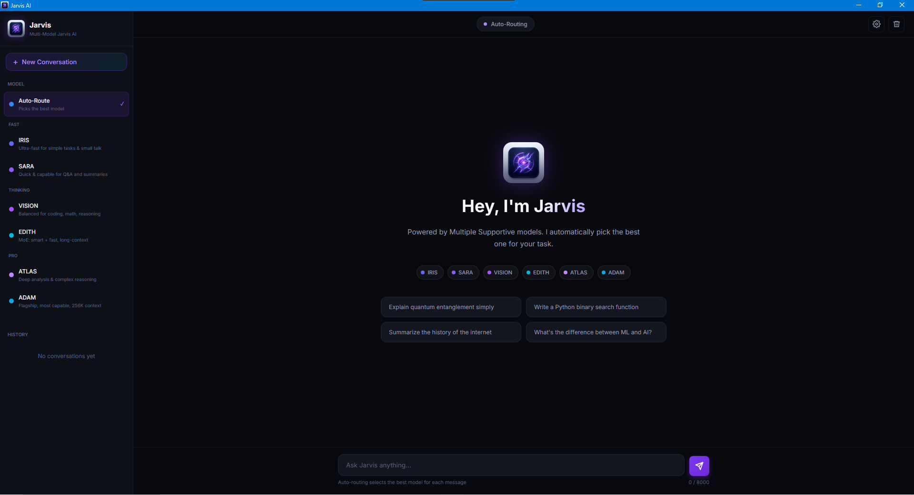

# 🌌 Jarvis: Next-Generation Multi-Model AI Assistant

  
  
<em>An intelligent, auto-routing AI chatbot powered by a dynamic multi-agent Gemma API architecture.</em>

---

## 📖 Overview

**Jarvis** is not just another chatbot; it is a comprehensive, locally-managed multi-agent AI ecosystem. Built for developers, researchers, and power users, Jarvis automatically analyzes your prompts and routes them to the most efficient and capable model for the task. 

Whether you need ultra-fast small talk, complex Python automation, deep academic analysis, or real-time voice recognition, Jarvis scales to the workload dynamically. By orchestrating six distinct AI models under one sleek, dark-mode user interface, it ensures you never waste compute on simple tasks or lack the necessary reasoning power for complex ones.

---

## ✨ Core Features

*   **🧠 Intelligent Auto-Routing:** The core engine analyzes the intent and complexity of every prompt, seamlessly routing it to the optimal model without manual intervention.
*   **🤖 6-Tier Multi-Agent Architecture:** Powered by specialized Gemma-based models handling everything from basic Q&A to 256K context-window reasoning.
*   **🎙️ Voice & Automation Ready:** Built with Python, allowing for deep integration with system control, screen vision, and speech processing. 
*   **📚 Persistent Memory Management:** Conversation histories are safely stored and easily accessible via the unified sidebar UI.
*   **🌙 Distraction-Free UI:** A modern, highly responsive graphical interface optimized for long coding and research sessions.
*   **⚡ Zero-Friction Prompting:** Features one-click suggestion chips for common tasks like code generation, summarization, and scientific explanations.

---

## ⚙️ The Intelligence Engine (Model Ecosystem)

Jarvis distributes workloads across six distinct models grouped into three primary compute tiers:

### ⚡ FAST TIER (Low Latency / Everyday Tasks)
*   **`IRIS` (Ultra-Fast):** Your go-to for simple tasks, quick definitions, and casual small talk. Designed for instantaneous response times.
*   **`SARA` (Quick & Capable):** Engineered specifically for extracting information, summarizing large blocks of text, and handling standard Q&A.

### 🧠 THINKING TIER (Logic & Problem Solving)
*   **`VISION` (Balanced):** The workhorse for logic. Highly tuned for writing scripts, debugging code, solving mathematical equations, and structured reasoning.
*   **`EDITH` (Mixture of Experts):** Utilizing an MoE architecture, EDITH is both highly intelligent and incredibly fast, excelling at mid-to-high complexity tasks requiring long context retention.

### 🚀 PRO TIER (Heavyweight Compute)
*   **`ATLAS` (Deep Analysis):** Specialized for comprehensive research, academic-level deep dives, and highly complex logical deduction.
*   **`ADAM` (The Flagship):** The most capable model in the fleet. Boasting a massive **256K context window**, ADAM is designed for analyzing entire codebases, reading full books, and managing massive data sets.

---

## 🛠️ Technology Stack

Jarvis is built on a robust Python foundation to allow for maximum flexibility and system-level integration.

*   **Core Backend:** Python 3.x
*   **AI Engine:** Gemma API (Multi-Agent System)
*   **System Automation:** `PyAutoGUI` (for GUI automation & control)
*   **Computer Vision:** `OpenCV` (for screen-reading and environmental awareness)
*   **Voice Processing:** `SpeechRecognition` (for hands-free interaction)

---

## 🚀 Installation & Setup

### Option 1: Quick Install (Recommended for Windows Users)

The easiest way to get started is by using the standalone Windows installer. You do not need Python installed on your system for this method.

1. Go to the [Releases page](../../releases/latest) of this repository.
2. Download the latest `Jarvis.AI.Setup.1.0.0.exe` file.
3. Run the installer and follow the on-screen instructions.
4. Launch Jarvis from your Start menu.
5. On the first launch, go to Settings and input your Google API key.
6. For API key visit to [Google AI Studio](https://aistudio.google.com/api-keys).
7. Create new API and Paste to Jarvis AI App.

---

## 💡 How Auto-Routing Works

When you submit a prompt (e.g., *"Write a Python binary search function"*), Jarvis's lightweight router evaluates the request using NLP classification:
1. **Intent Recognition:** Identifies the task type (e.g., coding, chatting, summarizing).
2. **Complexity Scoring:** Estimates the token count and logic required.
3. **Model Dispatch:** For the coding example above, the router recognizes the need for logic and automatically dispatches the prompt to **VISION** or **EDITH**, bypassing the lighter and heavier models to save time and compute.

---

## 🗺️ Roadmap

- [x] Multi-model integration (6 distinct models).
- [x] Auto-routing logic implementation.
- [x] Modern Dark UI development.
- [x] Standalone `.exe` packaging for easy installation.
- [ ] Direct system automation integration (PyAutoGUI hooks).
- [ ] Real-time voice commands and TTS output.
- [ ] Computer vision capabilities via OpenCV.

---

## 👨‍💻 Author & Lead Developer

**Krishna Sharma**  
*Known as Coder Bhaiya / Code With Krishna*

---

  <i>"Sometimes you gotta run before you can walk."</i> 
  <b>Built with ❤️ by Code With Krishna</b>

